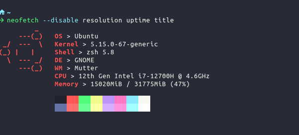

# Dotfiles

Bootstrap my terminal configurations and general OS configs for development :)

## Install

```sh
git clone git@github.com:luisjmarrero/dotfiles.git .dotfiles
```

### On MacOS

```sh
./setup_mac.sh
```

### On Ubuntu

```sh
./setup_ubuntu.sh
```

## Final Result Views




> `neofetch --disable resolution uptime title`

## General Structure

```
 ~
└──  .dotfiles
    ├──  alacritty
    │  ├──  alacritty-master
    │  └──  alacritty.yml
    ├──  amethyst
    │  └──  amethyst.yml
    ├──  bin
    │  ├──  backup_files.sh
    │  ├──  configure_tools_macos.sh
    │  ├──  configure_tools_ubuntu.sh
    │  ├──  install_amethyst.sh
    │  ├──  install_brew.sh
    │  ├──  install_brew_packages.sh
    │  ├──  install_sdkman.sh
    │  ├──  install_starship.sh
    │  ├──  install_tools_macos.sh
    │  ├──  install_tools_ubuntu.sh
    │  └──  install_zsh_plugins.sh
    ├──  starship
    │  └──  starship.toml
    ├──  tmux
    │  └──  tmux.conf
    ├──  zsh
    │  ├──  alias.zsh
    │  └──  rc.zsh
    ├──  setup_mac.sh
    └──  setup_ubuntu.sh
```

> gerate view: `lt --level=2 --sort=type --git-ignore --ignore-glob=".git*|README.md|plugins|*assets*"`

## Tools

### MacOS
- [homebrew](https://brew.sh/)
- [sdkaman](https://sdkman.io/)
- [starship](https://starship.rs/)
- [amethyst](https://ianyh.com/amethyst/)

## zsh plugins

- [fast-syntax-highlighting](https://github.com/zdharma/fast-syntax-highlighting)
- [zsh-autosuggestions](https://github.com/zsh-users/zsh-autosuggestions)